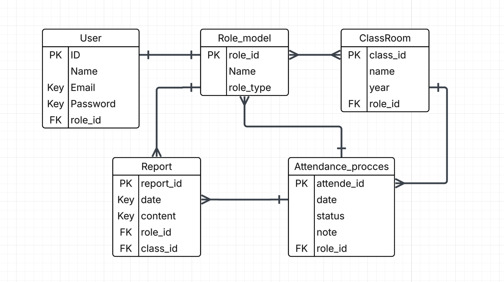

# 🛠️ Hudoor - Attendance Management System

## 📌 Project Description

**Hudoor** is a full-stack web application designed to streamline attendance tracking for schools and educational institutions. The system supports three main user roles:

- 🧑‍🎓 **Students**: View their attendance records and receive notifications.
- 🧑‍🏫 **Teachers**: Access attendance reports for their assigned classes.
- 🛂 **Attendance Officers**: Record daily attendance, send absence notifications, and generate reports.

Built with Django REST Framework on the backend and React.js on the frontend, the system uses JWT authentication for secure access. The project is Dockerized for easy deployment and scalability.

---

## 🧰 Tech Stack

### 🔙 Backend
- **Django** – Web framework for building the backend.
- **Django REST Framework (DRF)** – For creating RESTful APIs.
- **PostgreSQL** – Database to store users and attendance data.
- **JWT Authentication** – Secure token-based authentication.
- **Djoser** – Authentication system for user registration and login.
- **Django CORS Headers** – Enable CORS for frontend-backend communication.

### 🎨 Frontend
- **React.js** – JavaScript library for building user interfaces.
- **React Router DOM** – Client-side routing.
- **Fetch API** – Built-in browser API used for sending HTTP requests to the backend.
- **CSS** – For styling the frontend using standard CSS files.

---

## ❄️ IceBox Features
- Add **Guardian Portal** to notify parents about attendance.
- Admin Dashboard with advanced filters and statistics.
- SMS / Email notifications for absentees.
- Export attendance reports to PDF/Excel.
- Dark Mode and Theme Customization.

---

## 🔗 Repositories & Deployment

- 🔄 **Backend Repo**: [Hudoor Backend](https://github.com/Sadeemamri2/backend)
- 🎨 **Frontend Repo**: [Hudoor Frontend](https://github.com/Sadeemamri2/frontend)
- 🌐 **Live App**: [Deployed Site](https://your-frontend-url.com)
- ⚙️ **Deployed Backend**: [Deployed API](https://your-backend-url.com)

---

## 👥 User Roles & Permissions

| Role                | Permissions |
|---------------------|-------------|
| **Attendance Officer** | Full access to users, classrooms, attendance, and reports |
| **Teacher**            | Read-only access to assigned classes and students |
| **Student**            | View personal attendance records and notifications |

---

## 🛣️ API Routing Overview

### 1. **Users**
| Endpoint                | Method | Description              | Access         |
|-------------------------|--------|--------------------------|----------------|
| `/api/users/`           | GET    | List all users           | Officer        |
| `/api/users/:id/`       | GET    | Retrieve user by ID      | Officer, Teacher |
| `/api/users/`           | POST   | Create new user          | Officer        |
| `/api/users/:id/`       | PUT    | Update user info         | Officer, Self  |
| `/api/users/:id/`       | DELETE | Delete user              | Officer        |

### 2. **Roles**
| Endpoint                | Method | Description              | Access         |
|-------------------------|--------|--------------------------|----------------|
| `/api/roles/`           | GET    | List all roles           | Officer        |
| `/api/roles/:id/`       | GET    | Retrieve role            | Officer        |
| `/api/roles/`           | POST   | Create new role          | Officer        |
| `/api/roles/:id/`       | PUT    | Update role              | Officer        |
| `/api/roles/:id/`       | DELETE | Delete role              | Officer        |

> **Note:** Only 3 role types exist: `Officer`, `Teacher`, and `Student`.

### 3. **Classrooms**
| Endpoint                | Method | Description              | Access         |
|-------------------------|--------|--------------------------|----------------|
| `/api/classrooms/`      | GET    | List all classrooms      | Officer, Teacher |
| `/api/classrooms/:id/`  | GET    | Retrieve classroom       | Officer, Teacher |
| `/api/classrooms/`      | POST   | Create new classroom     | Officer        |
| `/api/classrooms/:id/`  | PUT    | Update classroom         | Officer        |
| `/api/classrooms/:id/`  | DELETE | Delete classroom         | Officer        |

### 4. **Attendance**
| Endpoint                | Method | Description              | Access         |
|-------------------------|--------|--------------------------|----------------|
| `/api/attendance/`      | GET    | Get all attendance       | Officer, Teacher |
| `/api/attendance/:id/`  | GET    | Get single attendance    | Officer, Teacher |
| `/api/attendance/`      | POST   | Mark attendance          | Officer        |
| `/api/attendance/:id/`  | PUT    | Update attendance        | Officer        |
| `/api/attendance/:id/`  | DELETE | Delete attendance        | Officer        |

### 5. **Reports**
| Endpoint                | Method | Description              | Access         |
|-------------------------|--------|--------------------------|----------------|
| `/api/reports/`         | GET    | Get all reports          | Officer, Teacher |
| `/api/reports/:id/`     | GET    | Get report by ID         | Officer, Teacher |
| `/api/reports/`         | POST   | Create new report        | Officer        |
| `/api/reports/:id/`     | DELETE | Delete report            | Officer        |

---

## 🗂️ ERD (Entity Relationship Diagram)



---

## 🐳 Docker Setup Instructions

1. **Install Docker**:
   - Download and install Docker Desktop for Mac from the [official Docker website](https://www.docker.com/products/docker-desktop).
   - Once installed, open Docker Desktop, and make sure Docker is running on your Mac.

2. **Clone the Project**:
   - Clone the repository from GitHub:
     ```bash
     git clone https://github.com/Sadeemamri2/backend.git
     ```

3. **Set Up the Environment**:
   - In the project directory, build the Docker containers:
     ```bash
     docker-compose build
     ```

4. **Start the Containers**:
   - To start the application using Docker:
     ```bash
     docker-compose up
     ```

5. **Access the Application**:
   - Once the containers are running, access the application at:
     - **Backend**: `http://localhost:8000`
     - **Frontend**: `http://localhost:3000`

6. **Stop the Containers**:
   - To safely stop the containers:
     ```bash
     docker-compose down
     ```


### 1. Clone the repos:
```bash
git clone https://github.com/Sadeemamri2/backend
git clone https://github.com/Sadeemamri2/frontend
